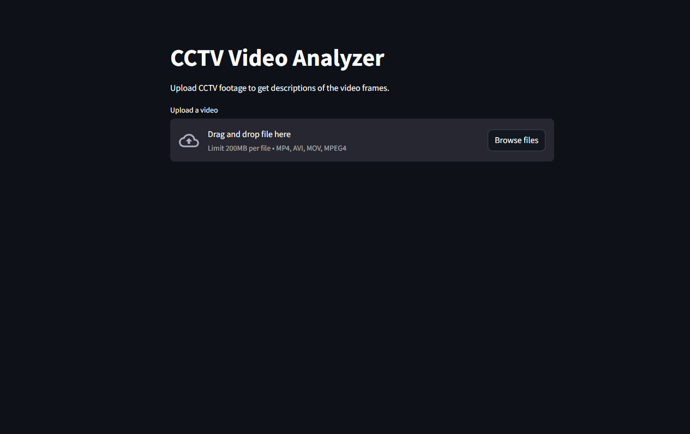
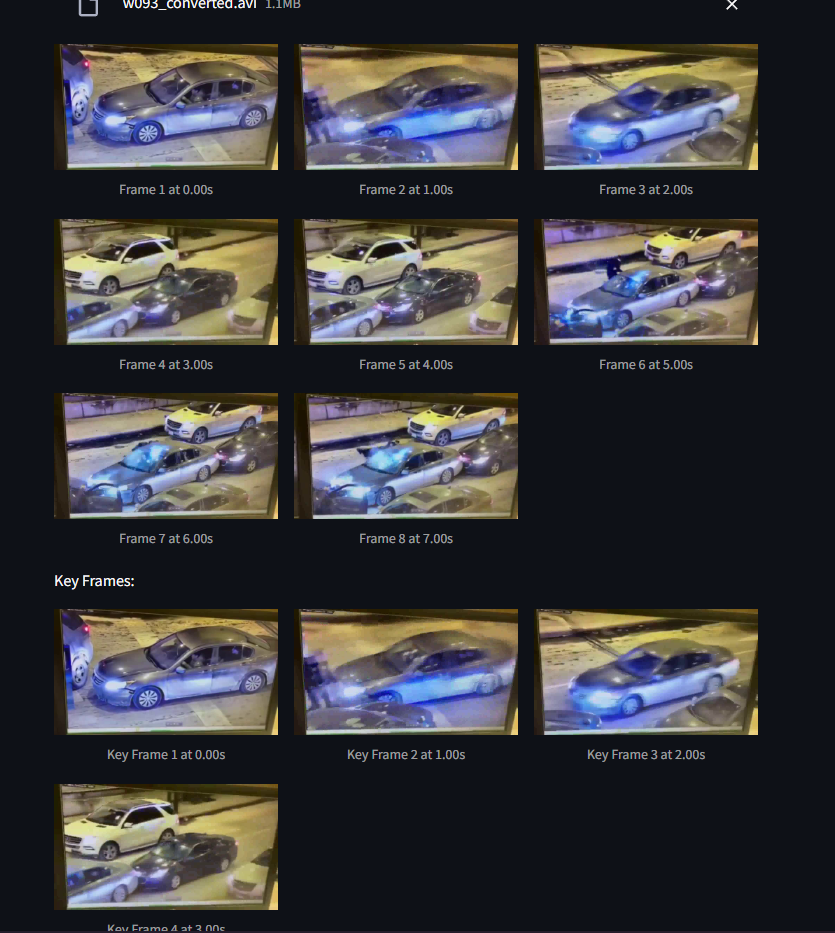
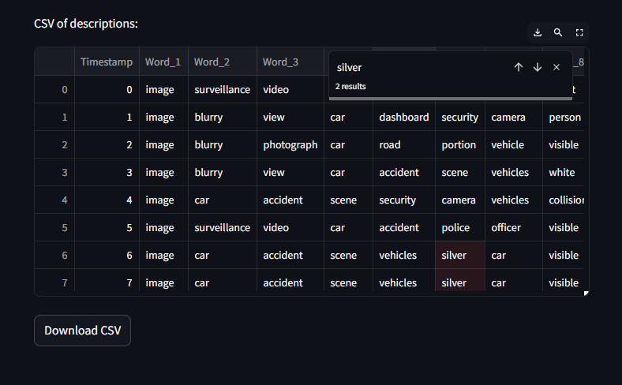

# SurvBot 📹
[](https://www.python.org/)
[](https://opensource.org/licenses/Apache-2.0)


<a href="https://example.com">
  
</a>
<a href="https://example.com">
  
</a>

Welcome to SurvBot, a modern GenAI implementation of Image Captioning using Moondream VLM. The modern surveillance systems are becoming one of the most annoying sources of data that we fight on a daily basis with. With users putting dozens and dozens of CCTV Cams over their campuses, any scope of objective video tagging is a nightmare.

We use Moondream, an easy to use modular and mind you, very very very tiny VLM, to image caption footages as they are fed into the Streamlit based web application. We then use a combination of Pandas and Streamlit Native CSV functions to let the end user persue through the Video Tagged CSV find points of interests.
## Steps to Run

#### Clone the Repository
```bash
git clone https://github.com/yourusername/video-frame-inference.git
```

#### Install Dependencies
```bash
pip install -r requirements.txt
```

#### Run Streamlit Application
```bash
streamlit run app.py
```

#### Upload Video
- Navigate to the app interface and upload a video file using the file uploader provided.



#### Key Frames
- The Application returns key frames from the video.



#### CSV
- You can then view, search, and download the CSV of the entire surveillance.



## Features
- Upload video files in formats such as MP4, MOV, or AVI.
- Key Frames
- Extract frames from the video at specified intervals.
- Display extracted frames with timestamps in the Streamlit app.

## Possible Features
- [ ] Add frame inference using a pre-trained model.
- [ ] Implement frame filtering based on specific criteria.
- [ ] Provide options to download extracted frames or data.

## License
This repository is under the MIT License. Read more [here](LICENSE).

---

This format should fit well with your existing repo style and provide clear instructions for setting up and using the application. Let me know if there are any specific details you'd like to adjust or add!